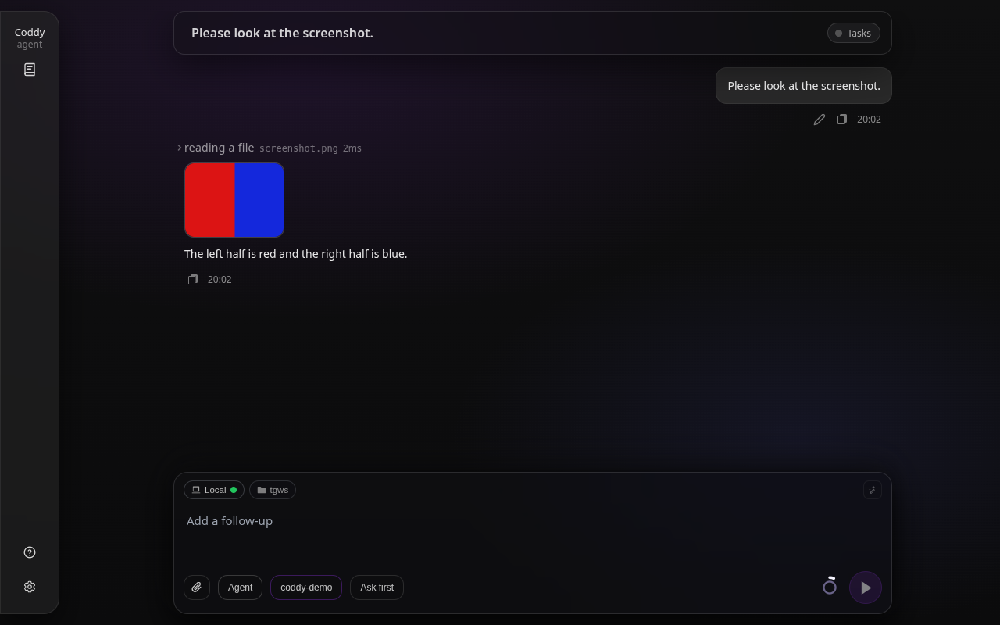

# Images

A model that reads images gets a picture two ways: you attach it to a prompt, or the agent opens an image file of the workspace with `read`. This page covers the second way and where you see what the agent looked at. Attaching a picture in the web composer is described in [Web UI](../surfaces/web-ui.md#composer-file-attachments-multimodal) and, for a message sent while a turn runs, in [Message queue](message-queue.md).

## A model that reads images

Pictures reach only a model marked as one that takes them, with `multimodal: true` on its row of `models`:

```yaml
models:
  - model: "openai/gpt-5.6-terra"
    multimodal: true
```

Every provider type sends them: an OpenAI-compatible endpoint as `image_url` parts, Anthropic as image blocks, the Codex backend as `input_image` parts, Devin with the prompt. Mark a model this way only when it really accepts images; a text-only endpoint refuses a request that carries one.

## Reading an image file

`read` tells a picture by its content, never by its name: a PNG, JPEG, GIF or WebP file is an image even without an extension, and a text file named `shot.png` is read as text. For a model that reads images, `read` answers with one line naming the file, its type, size in pixels and bytes, and the model is shown the picture itself:

```text
screenshots/after.png: PNG image, 1280x720, 45.2 KB. The picture is attached for you to look at.
```

Use it the way you would ask a person to look: check a screenshot the tests just saved, compare a rendered page before and after a change, read a diagram. Several images read in one step reach the model together.

A picture is refused, with the reason, when:

- the session's model does not read images - a model switch in the middle of a turn counts, since the check is made when the file is read;
- the file is larger than 3.75 MB, which base64 encoding turns into the 5 MB one Anthropic request takes per image;
- a side is longer than 8000 pixels;
- the content looks like an image but cannot be decoded.

For the last three the agent can save a scaled-down copy with a command and read that. A GIF is shown as its first frame, as a PNG: every provider takes that, and the rest of an animation is never decoded. Any other binary file - a PDF, an archive - is refused with its type and size, as before.

## What the model is sent

The picture stays with the result of the `read` that produced it. The transcript gains no extra message, so a reload, `/resume` in the console or an editor that loads the session shows the conversation as it was typed.

What goes to the provider is built from that transcript on every request. An OpenAI-compatible tool result cannot hold an image, and nothing may come between the results of one step, so the pictures of a step travel in one user message right after the step's tool results, named in the order they were read. The message is rebuilt the same way each time, so the provider's prompt cache keeps working.

A picture costs context like anything else the model reads, and it goes out with every request after the step that read it. A request carries at most the 20 newest pictures and 20 MB of them, which keeps a session of many screenshots within what a provider takes (the Anthropic API refuses a request over 32 MB, and wants pictures of at most 2000 pixels a side once a request holds more than 20); the step of an older picture names it as left out. When [result eviction](compaction.md#result-eviction) collapses an old `read`, its picture goes too. Either way the model reads the file again if it needs it. A session switched to a model without `multimodal` sends no picture at all, and the model is told which ones the earlier steps returned.

Coddy keeps a copy of every picture it showed the model with the session's assets (`~/.coddy/sessions/<id>/assets/`), under the file's name plus a digest of its content. The surfaces show that copy, so a screenshot overwritten a minute later still previews as the model saw it.

## Where you see it



*The picture a `read` showed the model, previewed under its row; a click opens it enlarged.*

| Surface | What it shows |
|---|---|
| [Web UI](../surfaces/web-ui.md) | A preview card under the `read` row; a click opens the picture enlarged. It works for a session started in the console or in Telegram, and through a remote server or a relay. |
| [Telegram](../surfaces/gateway.md) | The bot sends the picture into the chat as a photo, captioned with the file's name, while the turn runs. |
| [Console](../surfaces/console.md) | The `read` row with its one line of text. |
| [Editors](../surfaces/editors.md) | The `read` call with its one line of text. |
